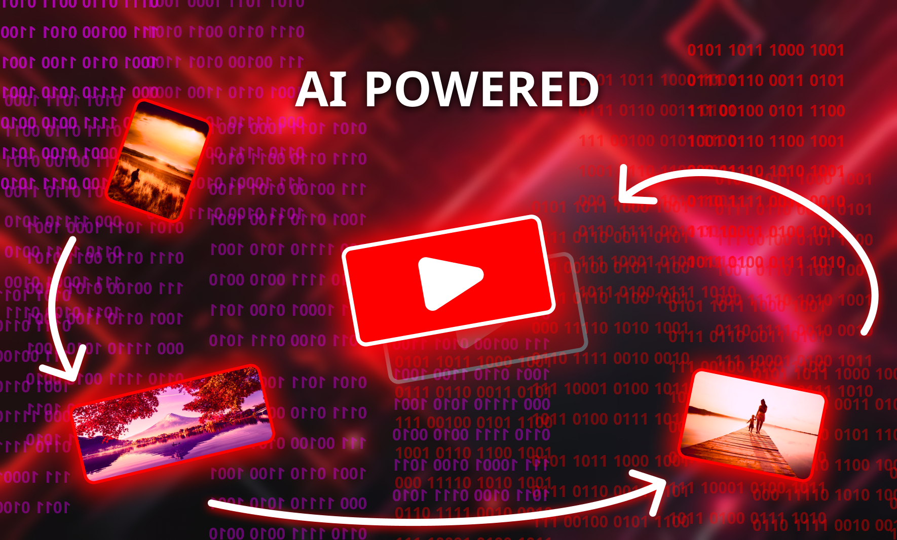

# YouTube Tool



A toolkit designed to create videos using AI or remix existing online clips and automatically publish them to YouTube.

---

## Overview

This tool automates the full pipeline: find clips on the internet, generate or remix video and audio with AI (or use non-AI fallbacks), assemble the final video, and post to YouTube accounts. It is built as a modular system where each component can be swapped or extended.

---

## AI Platforms Used

| Task              | Platform      |
| ----------------- | ------------- |
| Script Generation | OpenAI        |
| Voice Generation  | ElevenLabs AI |
| Video Generation  | HeyGen AI     |

### No-AI Fallbacks

* **Voice:** `espeakng` (TTS fallback)
* **Video:** Existing clips from [Mixkit](https://mixkit.co/) & [Pexels](https://pexels.com/)
* **Script:** OpenAI is still required

---

## Tool Components

### 1. Database

Central storage for all metadata, job states, assets, and logs. Exposes methods to save, query, and retrieve records used throughout the pipeline. </br></br>
`method`
```python
# Example methods
load_queries()
connect()
get_insert_query_and_create_cursor()
request_pexels_video()
add_pexels_video()
apply_conditions()
get_styles()
get_channels()
```

### 2. Video Scraper

**ClipsFromWeb** — searches for and downloads candidate videos/clips according to parameters (keywords, duration, license filters, source sites). Supplies curated clips for remixing or reuse. </br></br>
`class.method`
```python
MixkitScraper.get_new_videos()
PexelsScraper.get_new_videos()
PexelsScraper.download_video_from_url()
```

### 3. GenerateVideo

Assembles final video either by calling AI video generation (HeyGen) or by stitching together selected existing clips. Handles transitions, overlays, captions, and rendering settings. </br></br>
`class.method`
```python
AIVideoGenerator.list_voices()
AIVideoGenerator.list_avatars()
ManualVideoGenerator.generate_audio()
ManualVideoGenerator.define_video_data()
ManualVideoGenerator.generate_video()
```

### 4. GenerateAudio

Generates narration and audio tracks using ElevenLabs or, if configured, a local `espeakng` fallback. Supports background music mixing and normalization.
If it is used with local generation (no ElevenLabs), it is recommended on windows. windows.py holds the code for it. </br></br>
`file.class.method`
```python
file.class.method
windows.VoiceGeneratorWindowsEdge._generate_voice()
windows.VoiceGeneratorWindowsEdge._generate_empty()
windows.VoiceGeneratorWindowsEdge._generate_sound()
windows.VoiceGeneratorWindowsEdge._generate_audio()
main.VoiceGeneratorV2._generate_voice()
main.VoiceGeneratorV2._generate_empty()
main.VoiceGeneratorV2._generate_sound()
```

### 5. YoutubeBot

Automates uploads to YouTube, fills metadata (title, description, tags), schedules publish time, and optionally applies thumbnails and cards. </br></br>
`method`

```python
get_video()
__click_on_dropdown()
__click_on_upload_button()
__type_in_title_textarea() / __type_in_description_textarea()
__send_video()
__check_kids_feature()
__wait_the_video_to_process()
```

### 6. YoutubeProfileManagement

Manages multiple Google/YouTube profiles, credentials, and refresh tokens. Enables rotating or selecting accounts for uploads and manages rate limits and quotas.</br></br>
`method`

```python
load_all_profiles()
load_profiles_linking()
get_all_channels()
run()
```

---

## Usage Notes

* You will need API keys for **OpenAI**, **ElevenLabs**, and **HeyGen** if using AI-based paths.
* Respect content licenses when using clips from Mixkit, Pexels, or other sources — ensure they are permitted for your intended use.
* Script generation currently requires OpenAI. If you disable AI script generation, provide a custom script input.

---

Built for automation and modularity — extend components as needed. Replace or add AI providers or local fallbacks to match your deployment constraints.
---
## Status: ```In Development```
